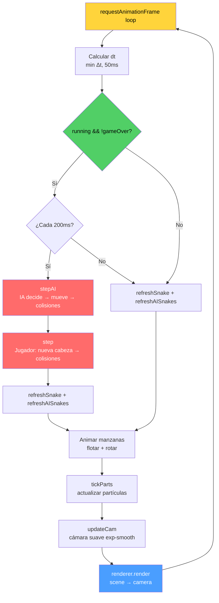

# 🐍 Snake 3D

Juego clásico de la serpiente renderizado en 3D con **Three.js**. Recoge manzanas, esquiva obstáculos y crece sin chocar — con modo multijugador contra IA, música retro y efectos de partículas.

## 🎮 Juego online

<https://cocobot.pages.dev/snake3d/>

## Características

- **Gráficos 3D** — Three.js con iluminación dinámica, cámara suave que sigue a la serpiente, y partículas al comer o morir.
- **Modo Solo** — El clásico Snake en 3D.
- **Modo Multijugador vs IA** — Compite contra 1, 2 o 3 serpientes controladas por inteligencia artificial.
- **3 niveles de dificultad** — Fácil, Medio y Difícil (afectan la tasa de error y agresividad de la IA).
- **4 colores de serpiente** — Verde, rojo, azul y amarillo.
- **Tablero configurable** — Ajusta el tamaño del grid con un slider (-50% a +50%).
- **Obstáculos progresivos** — Aparecen cada 3 manzanas recogidas (máximo 30).
- **Escalado proporcional** — El número de manzanas y obstáculos se ajusta automáticamente al tamaño del tablero (`calcNumApples()`, `calcMaxObstacles()`).
- **Reducción dinámica del tablero (shrink)** — Cada vez que muere una IA, el tablero se reduce progresivamente con countdown independiente, parpadeo rojo acelerado (curva cúbica), tick de advertencia y mensaje visible en los últimos 5 segundos. Las serpientes que quedan fuera pierden cola (-1 punto por segmento).
- **Música retro** — 10 pistas chiptune con reproductor integrado (play/pause, anterior, siguiente, loop automático).
- **Efectos de sonido** — Comer, girar, morir, sonidos direccionales cuando la IA come, y efectos de shrink (tick + boom).
- **Récords por configuración** — High scores guardados en `localStorage` por modo, dificultad y tamaño de tablero.
- **Controles táctiles** — Mitad izquierda/derecha de la pantalla para móvil.
- **Contador de partidas** — Total de juegos jugados guardado localmente.

## Controles

| Plataforma | Acción | Control |
|---|---|---|
| 🖥️ Escritorio | Girar izquierda | `←` o `A` |
| 🖥️ Escritorio | Girar derecha | `→` o `D` |
| 📱 Móvil | Girar izquierda | Tocar mitad izquierda |
| 📱 Móvil | Girar derecha | Tocar mitad derecha |

## Estructura del proyecto

```
snake3d/
├── index.html              # Punto de entrada (HTML + carga de scripts)
├── package.json            # Dependencias y scripts de test
├── css/
│   └── style.css           # Estilos del juego, overlay, HUD, selectores, música
├── js/
│   ├── config.js           # Configuración global, colores, modos, dificultades, logging
│   ├── state.js            # Estado global del juego (snake, score, grid, DOM refs)
│   ├── audio.js            # SFX (Web Audio API) + reproductor de música MP3
│   ├── scene.js            # Escena Three.js (renderer, cámara, luces, tablero dinámico)
│   ├── snake.js            # Mesh de la serpiente (build + refresh, multi-snake)
│   ├── apples.js           # Generación, colisión y render de manzanas
│   ├── obstacles.js        # Generación, validación y render de obstáculos
│   ├── particles.js        # Sistema de partículas (burst al comer/morir)
│   ├── ai.js               # IA oponentes (BFS, evaluación, cornering, corpses)
│   ├── ui.js               # Selectores UI (color, modo, dificultad, tamaño)
│   ├── game.js             # Lógica principal (step, die, cámara)
│   ├── controls.js         # Input: teclado + táctil
│   └── main.js             # Inicialización, game loop, WebGL context loss, start
├── music/                  # 10 pistas retro (MP3)
├── tests/                  # Tests unitarios (Jest)
│   ├── ai.test.js          # Tests de IA (direcciones seguras, BFS, cornering)
│   ├── apples.test.js      # Tests de manzanas (spawn, colisión, isOccupied)
│   ├── config.test.js      # Tests de configuración (resolveGridSize, high score key)
│   ├── game.test.js        # Tests de lógica de juego (step, die, cámara)
│   ├── obstacles.test.js   # Tests de obstáculos (isSafeForObstacle, spawn)
│   ├── state.test.js       # Tests de estado (snake, score, grid)
│   ├── ui.test.js          # Tests de selectores UI (config, estado)
│   ├── ui-dom.test.js      # Tests de manipulación DOM de UI
│   ├── shrink.test.js      # Tests de reducción dinámica del tablero
│   └── coverage.test.js    # Test de cobertura mínima
├── scripts/                # Scripts de build/test
│   ├── gen-bundle.js       # Genera bundle concatenado para tests
│   └── coverage-report.js  # Reporte HTML de cobertura
├── coverage/               # Reporte de cobertura LCOV (generado)
├── jest.config.js          # Configuración de Jest
├── jest.setup.js           # Setup global para tests (mocks de DOM, Three.js)
└── PLAN_IA_OPPONENTS.md    # Documentación del diseño de IA
```

## Arquitectura del código

El juego usa un **modelo de módulos globales** — cada archivo JavaScript define funciones y variables en el scope global, y se cargan en orden secuencial desde `index.html`. No hay bundler ni sistema de módulos ES; la dependencia se gestiona con el orden de carga:

```
config.js → state.js → audio.js → scene.js → snake.js → apples.js → obstacles.js
→ particles.js → ai.js → ui.js → game.js → controls.js → main.js
```

Cada módulo exporta sus funciones al scope global y, para tests, también a `module.exports` cuando se ejecuta en Node.js (Jest).

### Diagrama de arquitectura

```mermaid
graph TB
    subgraph INPUT["⌨️ Input"]
        CTRL[controls.js<br/>Teclado + Táctil]
        UI[ui.js<br/>Selectores UI]
    end

    subgraph CONFIG["⚙️ Configuración"]
        CFG[config.js<br/>Constantes, modos,<br/>dificultades, logging]
        ST[state.js<br/>Estado global,<br/>DOM refs, localStorage]
    end

    subgraph GAMELOGIC["🎮 Lógica de juego"]
        GAME[game.js<br/>step(), die(),<br/>updateCam()]
        AI[ai.js<br/>stepAI(), BFS,<br/>cornering, corpses]
    end

    subgraph RENDER3D["🎨 Renderizado 3D"]
        SCN[scene.js<br/>Three.js, WebGL,<br/>rebuildBoard()]
        SNAKE[snake.js<br/>buildSnake(),<br/>refreshSnake()]
        APPLE[apples.js<br/>spawnOneApple(),<br/>refreshApples()]
        OBS[obstacles.js<br/>spawnObstacle(),<br/>refreshObstacles()]
        PART[particles.js<br/>burst(), tickParts()]
    end

    subgraph AUDIO["🔊 Audio"]
        AUD[audio.js<br/>SFX Web Audio API,<br/>Music Player MP3]
    end

    subgraph ORCHESTRATION["🚀 Orquestación"]
        MAIN[main.js<br/>Game loop 60fps,<br/>init, JUGAR, resize,<br/>WebGL context loss]
    end

    subgraph EXTERNAL["🌐 APIs externas"]
        THREE[Three.js r128<br/>CDN]
        WEBGL[WebGL Renderer]
        WEBAUD[Web Audio API]
        LOCAL[localStorage<br/>high scores, games]
    end

    %% Dependencies
    CFG --> ST
    ST --> GAME
    ST --> AI
    ST --> SNAKE
    ST --> APPLE
    ST --> OBS
    ST --> PART
    ST --> AUD

    CFG --> AI
    CFG --> GAME
    CFG --> UI

    GAME --> SNAKE
    GAME --> APPLE
    GAME --> OBS
    GAME --> PART
    GAME --> AUD

    AI --> SNAKE
    AI --> APPLE
    AI --> OBS
    AI --> PART
    AI --> AUD

    SNAKE --> SCN
    APPLE --> SCN
    OBS --> SCN
    PART --> SCN

    SCN --> WEBGL
    AUD --> WEBAUD

    CTRL --> GAME
    UI --> ST

    MAIN --> GAME
    MAIN --> AI
    MAIN --> SNAKE
    MAIN --> APPLE
    MAIN --> OBS
    MAIN --> PART
    MAIN --> AUD
    MAIN --> SCN
    MAIN --> UI

    ST --> LOCAL
    SCN --> THREE

    %% Styling
    classDef input fill:#1a1a2e,stroke:#4a9eff,stroke-width:2px,color:#fff
    classDef config fill:#1a1a2e,stroke:#ff9f43,stroke-width:2px,color:#fff
    classDef game fill:#1a1a2e,stroke:#ff6b6b,stroke-width:2px,color:#fff
    classDef render fill:#1a1a2e,stroke:#51cf66,stroke-width:2px,color:#fff
    classDef audio fill:#1a1a2e,stroke:#cc5de8,stroke-width:2px,color:#fff
    classDef orchestration fill:#1a1a2e,stroke:#ffd43b,stroke-width:2px,color:#fff
    classDef external fill:#0d0d1a,stroke:#666,stroke-width:1px,stroke-dasharray:5 5,color:#aaa

    class CTRL,UI input
    class CFG,ST config
    class GAME,AI game
    class SCN,SNAKE,APPLE,OBS,PART render
    class AUD audio
    class MAIN orchestration
    class THREE,WEBGL,WEBAUD,LOCAL external
```

### Game loop — Flujo por frame



### `config.js` — Configuración y logging

Define todas las constantes del juego:

- **Grid**: tamaño base `22×22`, intervalo de movimiento `200ms`, ángulo de giro `π/2`.
- **Manzanas**: escalado proporcional con `calcNumApples(gridSize)` — más manzanas en tableros grandes.
- **Obstáculos**: spawn cada N manzanas (proporcional con `calcObstacleSpawnEvery()`), máximo proporcional con `calcMaxObstacles()`.
- **Shrink**: paso fijo `SHRINK_STEP=6` celdas por muerte de IA, countdown `SHRINK_COUNTDOWN=10s`, advertencia a los 5s, flash cúbico (0.8→3 Hz).
- **Modos**: `solo`, `vs2`, `vs3`, `vs4` con multiplicadores de grid (`1.0x`, `1.25x`, `1.50x`, `1.75x`).
- **Dificultades**: `easy`, `medium`, `hard` con tasas de error IA (`38%`, `10%`, `2%`) y agresividad de cornering (`0%`, `40%`, `85%`).
- **`resolveGridSize(mode, modifier)`**: calcula el tamaño del grid aplicando el multiplicador del modo + el modifier porcentual del slider (-50 a +50), forzando siempre un número par para que `half` sea entero y las celdas se alineen correctamente.
- **`getHighScoreKey(mode, difficulty, gridSize)`**: genera la clave de `localStorage` para guardar récords independientes por configuración.
- **Logging**: función `log()` que escribe en un div de debug y en `console.log`, con buffer de 80 entradas. También `showErr()` para errores visibles al usuario.

### `state.js` — Estado global

Variables compartidas por todos los módulos:

- **Snake**: array de `{x, z}`, `direction` (radianes), `score`, `running`, `gameOver`.
- **Tablero**: `apples[]`, `obstacles[]`, `gridSize`, `half`, `gridMinX/MaxX/MinZ/MaxZ` (límites dinámicos para shrink).
- **Shrink**: `shrinkCountdowns[]` (array de countdowns independientes), `GRID_SIZE` global (se actualiza en `initGame()` y `applyShrink()`).
- **Cámara**: `camSmoothX/Z`, `lookSmoothX/Z` para interpolación suave.
- **IA**: `gameMode`, `difficulty`, `playerColor`, `aiSnakes[]`, `corpses[]`.
- **DOM**: referencias a todos los elementos del HUD (score, high score, overlay, botones, etc.).
- **Persistencia**: `totalGames` y `highScore` leídos de `localStorage`.

### `scene.js` — Escena Three.js

Configura el entorno 3D:

- **Renderer**: WebGL con antialiasing, pixel ratio limitado a 2x.
- **Escena**: fondo `#0a0a12`, niebla `Fog` que se ajusta dinámicamente al tamaño del grid.
- **Cámara**: perspectiva 55° FOV, posición adaptativa al tamaño del tablero.
- **Iluminación**: luz ambiental azulada (`0x4466aa`), direccional blanca (sol), y `PointLight` cian que sigue a la cabeza de la serpiente.
- **`rebuildBoard(gridSize)`**: reconstruye el tablero completo dinámicamente:
  - **Suelo**: textura `CanvasTexture` generada proceduralmente con patrón ajedrezado (`#111122` / `#0c0c18`). Se genera un canvas 256×256 donde cada celda se pinta según `(x + y) % 2`.
  - **Paredes**: 4 `BoxGeometry` semitransparentes (`opacity: 0.35`) en los bordes del grid.
  - **Niebla**: se recalcula como `fog.near = gs * 0.5`, `fog.far = gs * 1.3`.
- **`gw(gridCoord)`**: convierte coordenadas de grid a mundo 3D añadiendo `0.5` para centrar en la celda.

### `snake.js` — Mesh de la serpiente

Crea y actualiza la representación 3D de la serpiente:

- **Geometrías compartidas**: `BoxGeometry(0.8, 0.5, 0.8)` para la cabeza, `BoxGeometry(0.7, 0.45, 0.7)` para el cuerpo — se reutilizan para todas las serpientes.
- **`buildSnake(color)`**: crea un `THREE.Group` con cabeza + 200 segmentos de cuerpo (inicialmente ocultos). La cabeza tiene material con `emissive` brillante; el cuerpo usa una versión atenuada (`color * 0.7`).
- **`refreshSnake()`**: actualiza posiciones del mesh según los datos del snake array. Los segmentos se escalan progresivamente (`1 - frac * 0.4`) para efecto de decrecimiento hacia la cola. Los segmentos sobrantes se ocultan.
- **Multi-snake**: soporta múltiples serpientes simultáneas. Cada una tiene su propio `groupData` con `{group, headM, bodyMs}`.

### `apples.js` — Manzanas

- **Mesh**: cada manzana es un `THREE.Group` con `SphereGeometry(0.25)` roja (`#ff2233`) + `PointLight` rojo (`#ff3344`) para efecto de brillo.
- **`isOccupied(x, z)`**: comprueba si una celda está ocupada por snake, otra manzana, obstáculo, IA o cadáver.
- **`spawnOneApple()`**: posición aleatoria con hasta 200 intentos, saltando celdas ocupadas.
- **`refreshApples()`**: actualiza posiciones 3D de los meshes según el array de manzanas.
- **Animación**: en el game loop (`main.js`), las manzanas flotan (`sin(now * 0.003)`) y rotan (`now * 0.002`).

### `obstacles.js` — Obstáculos

- **Mesh**: `BoxGeometry(0.8, 0.7, 0.8)` marrón oscuro (`#664444`) con emissive sutil.
- **Pool de 30 meshes**: se crean todos al inicio, se muestran/ocultan según sea necesario.
- **`isSafeForObstacle(x, z)`**: valida distancia mínima con Manhattan distance:
  - 6 celdas de cualquier serpiente (jugador + IA)
  - 3 celdas de otros obstáculos
  - 3 celdas de manzanas
- **`spawnObstacle()`**: hasta 300 intentos aleatorios. Si se coloca, reproduce SFX de obstáculo.

### `particles.js` — Sistema de partículas

- **`burst(x, z, color, count)`**: genera `count` partículas en la posición dada. Cada partícula es un `BoxGeometry` pequeño con color emissive que se mueve en dirección aleatoria con velocidad decreciente (fricción `0.95`). Se eliminan cuando la vida llega a 0.
- **`tickParts(dt)`**: actualiza posición, escala y vida de todas las partículas activas cada frame.

### `audio.js` — Efectos de sonido y música

**SFX (Web Audio API)**:
- **`sfxEat()`**: tono ascendente (587→784 Hz) al comer.
- **`sfxTurn()`**: click suave al girar.
- **`sfxDie()`**: tono descendente (180→120 Hz) al morir.
- **`sfxObstacle()`**: tono de advertencia al aparecer obstáculo.
- **`sfxAiEat(pan)`**: sonido direccional con `StereoPanner` basado en posición relativa al jugador.
- **`sfxShrinkTick()`**: tick agudo (660 Hz) en cada parpadeo de shrink.
- **`sfxShrinkComplete()`**: boom profundo al completar la reducción.

**Music Player (HTML5 Audio)**:
- 10 pistas retro MP3 con reproductor integrado.
- Controles: play/pause, anterior, siguiente.
- **Loop automático**: al terminar la última canción, vuelve a la primera.
- **Anti-autoplay block**: si el usuario pausa y la canción termina, solo cambia al siguiente track sin intentar `play()` (el navegador bloquea autoplay tras pausa manual).
- Shuffle y selección aleatoria al iniciar.

### `ai.js` — Inteligencia artificial

El módulo más complejo. Gestiona serpientes IA con comportamiento autónomo:

**Inicialización (`initAI`)**:
- Lee `AI_COUNT[gameMode]` para determinar cuántas IA crear.
- Asigna colores aleatorios de los disponibles (excluyendo el color del jugador).
- Posiciona cada IA en un ángulo equidistante a `0.35 * gridSize` del centro.
- Cada IA empieza con 4 segmentos y dirección hacia el centro.

**Evaluación de direcciones (`aiEvaluateDirections`)**:
- Prueba las 3 direcciones posibles: seguir, girar izquierda, girar derecha.
- Descarta las que lleven a colisión con: paredes, propio cuerpo, obstáculos, cadáveres, jugador u otras IA.
- Devuelve el array de direcciones seguras.

**BFS — Flood-fill (`countReachable`)**:
- Desde una posición, cuenta cuántas celdas son alcanzables con BFS (hasta `maxSteps = 30`).
- Construye un mapa de celdas bloqueadas (propio cuerpo + obstáculos + cadáveres + jugador + IA).
- Esta métrica evita que la IA se atrape a sí misma en callejones sin salida.

**Decisión de dirección (`aiDecideDirection`)**:
1. Detección de stuck: si la IA visita ≤2 posiciones únicas en 6 ticks, fuerza dirección segura aleatoria.
2. Evalúa direcciones seguras.
3. Filtra por `minSafeSpace()` — exige espacio mínimo alcanzable (relajado a 50% cerca de bordes para evitar bucles).
4. Aplica tasa de error según dificultad (38% fácil, 10% medio, 2% difícil) — si falla, elige al azar.
5. Si no falla, **scorea** cada dirección segura: `space * 3 - appleDist`. El flood-fill (`space`) tiene peso moderado, la distancia a la manzana es secundaria pero significativa.
6. Penaliza celdas en zona de shrink (`cellInShrinkZone()` → -500 puntos).
7. Anti-trap: exige ≥2 rutas de escape (≥1 cerca de bordes).
8. Devuelve la dirección con mejor score.

**Selección de manzana (`bestApple`)**:
- Modo fácil: simplemente la manzana más cercana.
- Modo medio/difícil: BFS a cada manzana, score = `1000 (si reachable) - manhattanDist + spaceAfter * 0.3`. El factor de espacio está escalado para no penalizar manzanas del borde.

**Cornering (`aiCorneringStrategy`)**:
- Activa en modo medio (40%) y difícil (85%).
- Busca serpientes más cortas cerca de paredes (≤ 3 celdas del borde).
- Si la distancia Manhattan es < 10, la IA persigue al objetivo.

**Muerte de IA (`aiDie`)**:
- Convierte el cuerpo en **cadáver**: array de `{x, z, color}` que actúa como obstáculo permanente.
- Crea meshes 3D del cadáver con color atenuado (`baseColor * 0.35`) + `roughness: 0.8`.
- Muestra mensaje de muerte en pantalla (auto-hide tras 3 segundos).
- Emite partículas rojas.
- **Activa shrink**: llama a `maybeTriggerShrink()` → inicia countdown de 10s con `SHRINK_STEP=6` celdas.

**Movimiento (`stepAI`)**:
- Se ejecuta antes del step del jugador cada tick.
- Para cada IA viva: decide dirección → mueve → comprueba colisiones → come manzanas.
- Si come, reproduce SFX direccional (pan basado en posición relativa al jugador).

### `ui.js` — Interfaz de configuración

- **Selectores**: chips clicables para color, modo, dificultad + slider para tamaño del grid.
- **`uiState`**: objeto que guarda la configuración seleccionada (`selectedColor`, `selectedMode`, `selectedDifficulty`, `selectedSizeMod`).
- **`getGameConfig()`**: devuelve el config completo con `gridSize` calculado vía `resolveGridSize()`.
- **`updateDifficultyVisibility()`**: oculta dificultad en modo solo.
- **`updateHighScoreDisplay()`**: lee el high score de `localStorage` para la configuración actual y lo muestra.

### `game.js` — Lógica principal del juego

**`initGame()`**:
- Reconstruye el tablero con `rebuildBoard(gridSize)`.
- Limpia grupos de serpientes y cadáveres.
- Inicializa snake con 4 segmentos en `(-5, 0)` a `(-8, 0)`.
- Construye mesh, obstáculos y manzanas.
- Inicializa variables de cámara suave.

**`turnL()` / `turnR()`**:
- Modifican `direction` en ±`π/2`. Solo si `running` y no `gameOver`.
- Reproducen SFX de giro.

**`step()` — Tick del juego**:
1. Calcula nueva posición de la cabeza: `nx = x + cos(direction)`, `nz = z + sin(direction)`.
2. **Colisiones**:
   - Paredes: fuera de `[-half, half)`.
   - Propio cuerpo: alguna celda del snake coincide.
   - Obstáculos: alguna celda de `obstacles[]` coincide.
   - IA: alguna celda de cualquier serpiente IA viva coincide.
   - Cadáveres: alguna celda de `corpses[]` coincide.
3. Si colisión → `die(cause)`.
4. Si no: `unshift` nueva cabeza.
5. **Comer manzana**: si la cabeza está en una manzana → `score++`, SFX, partículas, respawn manzana.
6. Cada 3 manzanas → `spawnObstacle()`.
7. Si no comió → `pop` cola.

**`die(cause)`**:
- Detiene el juego (`running = false`, `gameOver = true`).
- Guarda high score en `localStorage` con clave específica de la configuración.
- Incrementa contador de partidas.
- Muestra mensaje de causa de muerte en español.
- Muestra overlay con botón "REINTENTAR".

**Shrink — Reducción dinámica del tablero**:
- **`maybeTriggerShrink()`**: se activa al morir una IA. Si hay serpientes vivas y `gridSize > GRID_MIN`, inicia un countdown de 10s.
- **`processShrinkCountdowns()`**: se ejecuta cada frame en el game loop. Procesa todos los countdowns activos en paralelo.
- **`applyShrink()`**: reduce el tablero en `SHRINK_STEP` celdas, recalcula `GRID_SIZE`, `half`, `NUM_APPLES`, `MAX_OBSTACLES`, `OBSTACLE_SPAWN_EVERY`. Recorta colas que quedan fuera (-1 punto/segmento), mata cabezas fuera de límites, y refresca entidades visuales.
- **`removeOutOfBounds()`**: ajusta arrays de manzanas/obstáculos al nuevo límite, elimina las que quedan fuera, spawnea las faltantes, llama a `refreshApples()`/`refreshObstacles()`.
- **`updateShrinkFlashes()`**: parpadeo rojo en celdas a eliminar con velocidad cúbica (0.8→3 Hz). Tick de sonido en cada transición OFF→ON.
- **`showShrinkWarning()`**: mensaje visible en los últimos 5 segundos del countdown (`top: 120px`).

**`updateCam(dt)` — Cámara suave**:
- **Head interpolation**: la posición de la cabeza se interpola con `1 - exp(-12 * dt)` para movimiento fluido entre celdas.
- **Camera follow**: la cámara sigue la cabeza interpolada con `1 - exp(-8 * dt)`.
- **Look-ahead**: la cámara mira `3` unidades adelante en la dirección actual.
- **Adaptativo**: en móvil, la cámara está más lejos (`7` vs `5`) y más alto (`6` vs `4.5`) para ver más del tablero.

### `controls.js` — Input

- **Teclado**: `keydown` listener para `←`, `→`, `A`, `D`. Previene scroll con `preventDefault()`.
- **Táctil**: dos zonas (`#tz-left`, `#tz-right`) con `touchstart` listener. `passive: false` para prevenir scroll.

### `main.js` — Inicialización y game loop

**Inicialización**:
- `buildSnake()` + `buildObstacles()` + `buildApples()` → crean los pools de meshes.
- `initMusic()` → configura el reproductor.
- `initUISelectors()` → crea los selectores en el overlay.
- `requestAnimationFrame(loop)` → arranca el loop.

**Game loop (`loop(now)`)**:
1. Calcula `dt` (delta time en segundos, capado a 50ms).
2. Si `running && !gameOver`:
   - Cada `MOVE_INTERVAL` (200ms): ejecuta `stepAI()` (si hay IA), luego `step()` del jugador.
   - `refreshSnake()` + `refreshAISnakes()` → actualizan meshes.
3. **Animación manzanas**: flotación + rotación (seno + tiempo).
4. `tickParts(dt)` → actualiza partículas.
5. `updateCam(dt)` → cámara suave.
6. `renderer.render(scene, camera)`.

**Botón JUGAR**:
- `initAudio()` → desbloquea Web Audio API (requiere interacción del usuario).
- Lee config de UI (`getGameConfig()`).
- Oculta overlay, inicia juego (`initGame()`).
- Inicializa IA (`initAI()`) y construye meshes de IA.
- Arranca (`running = true`).

**WebGL context loss**:
- `webglcontextlost` → detiene el juego.
- `webglcontextrestored` → reconstruye la escena si es posible.

**Resize**: adapta cámara y renderer al tamaño de ventana.

## Modos de juego

| Modo | Serpientes IA | Grid base | Dificultad |
|---|---|---|---|
| **Solo** | 0 | 22×22 | — |
| **vs 2** | 1 | 28×28 | Sí |
| **vs 3** | 2 | 33×33 | Sí |
| **vs 4** | 3 | 39×39 | Sí |

El tamaño del tablero se ajusta con el slider: `-50%` a `+50%` sobre el base del modo.

## Flujo de datos

```
User click JUGAR
  → getGameConfig() (modo, dificultad, color, gridSize)
  → initGame() (rebuildBoard, snake init, obstacles, apples)
  → initAI() (spawn AI snakes, assign colors)
  → buildSnake(ai.color) × N (crear meshes IA)
  → running = true

Game loop (60fps):
  → cada 200ms:
    → stepAI() (IA decide dirección → mueve → colisiones → comer)
    → step() (jugador: nueva cabeza → colisiones → comer → pop cola)
  → refreshSnake() + refreshAISnakes() (actualizar meshes 3D)
  → animar manzanas (flotar + rotar)
  → tickParts() (partículas)
  → updateCam() (cámara suave)
  → render()
```

## Tests

```bash
npm install          # Instalar Jest
npm test             # Ejecutar todos los tests
npm run test:watch   # Modo watch
npm run test:coverage # Con cobertura
npm run coverage     # Reporte HTML de cobertura
```

Los tests usan un **bundle concatenado** (`tests/snake3d-bundle.js`) generado por `scripts/gen-bundle.js` que une todos los módulos en orden. `jest.setup.js` mockuea el DOM y Three.js para que el código del juego funcione en Node.js.

## Tecnologías

- **Three.js r128** — Renderizado 3D (WebGL)
- **Web Audio API** — Efectos de sonido generados proceduralmente (osciladores: square, sine, sawtooth, triangle)
- **HTML5 Audio** — Reproducción de música MP3
- **Canvas 2D** — Textura del suelo ajedrezada (generada proceduralmente)
- **Jest + jsdom** — Tests unitarios en Node.js
- **Vanilla JS** — Sin frameworks, módulos globales con `module.exports` condicional para tests

## Autor

[Cocobot](https://cocobot.pages.dev) — Raúl
