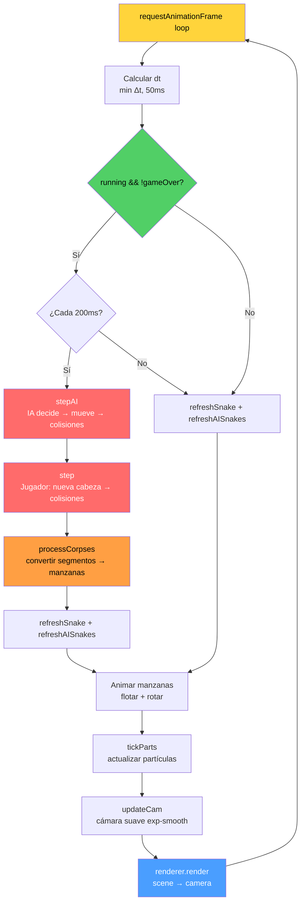

# 🐍 Snake 3D

Juego clásico de la serpiente renderizado en 3D con **Three.js**. Recoge manzanas, esquiva obstáculos y crece sin chocar — con modo multijugador contra IA, música retro y efectos de partículas.

## 🎮 Juego online

<https://cocobot.pages.dev/snake3d/>

## Características

- **Gráficos 3D** — Three.js con iluminación dinámica, cámara suave que sigue a la serpiente, y partículas al comer o morir.
- **Modo Solo** — El clásico Snake en 3D.
- **Modo Multijugador vs IA** — Compite contra hasta 7 serpientes controladas por inteligencia artificial (modos vs2 a vs8).
- **3 niveles de dificultad** — Fácil, Medio y Difícil (afectan la tasa de error y agresividad de la IA).
- **8 colores de serpiente** — Verde, rojo, azul, amarillo, cyan, purple, naranja, salmón.
- **Tablero configurable** — Ajusta el tamaño del grid con un slider (-50% a +50%). Hasta 66×66 en vs8, con textura de casillas nítida incluso en tableros grandes.
- **Obstáculos progresivos** — Aparecen cada N manzanas recogidas (proporcional al tamaño del tablero).
- **Escalado proporcional** — El número de manzanas y obstáculos se ajusta automáticamente al tamaño del tablero (`calcNumApples()`, `calcMaxObstacles()`).
- **Reducción dinámica del tablero (shrink proporcional)** — Al morir una IA, el tablero se reduce progresivamente basado en serpientes vivas vs iniciales. Cuando todas las IA mueren, vuelve al tamaño solo de 22×22. Countdown de 10s, parpadeo rojo acelerado (curva cúbica), tick de advertencia y mensaje visible en los últimos 5 segundos.
- **Cadáveres progresivos** — Al morir una IA, su cuerpo queda visible atenuado y se convierte en manzanas segmento a segmento (cabeza → cola), una por tick. Los cadáveres actúan como obstáculos sólidos hasta que se consumen completamente. Las manzanas de cadáver son bonus: al comerse desaparecen y no reaparecen en una posición aleatoria.
- **Música retro** — 20 pistas chiptune con reproductor integrado (play/pause, anterior, siguiente, loop automático).
- **Efectos de sonido** — Comer, girar, morir, sonidos direccionales cuando la IA come, y efectos de shrink (tick + boom).
- **Récords por configuración** — High scores guardados en `localStorage` por modo, dificultad y tamaño de tablero.
- **Controles táctiles** — Mitad izquierda/derecha de la pantalla para móvil.
- **Contador de partidas** — Total de juegos jugados guardado localmente.

## Controles

| Plataforma | Acción | Control |
|---|---|---|
| 🖥️ Escritorio | Girar izquierda | `←` o `A` |
| 🖥️ Escritorio | Girar derecha | `→` o `D` |
| 📱 Móvil | Girar izquierda | Tocar mitad izquierda |
| 📱 Móvil | Girar derecha | Tocar mitad derecha |

## Estructura del proyecto

```
snake3d/
├── index.html              # Punto de entrada (HTML + carga de scripts)
├── package.json            # Dependencias y scripts de test
├── css/
│   └── style.css           # Estilos del juego, overlay, HUD, selectores, música
├── js/
│   ├── config.js           # Configuración global, colores, modos, dificultades, logging
│   ├── state.js            # Estado global del juego (snake, score, grid, corpses, DOM refs)
│   ├── audio.js            # SFX (Web Audio API) + reproductor de música MP3
│   ├── scene.js            # Escena Three.js (renderer, cámara, luces, tablero dinámico nítido)
│   ├── snake.js            # Mesh de la serpiente (build + refresh, multi-snake)
│   ├── apples.js           # Generación, colisión, índice y render de manzanas + corpseSet hash
│   ├── obstacles.js        # Generación, validación y render de obstáculos
│   ├── particles.js        # Sistema de partículas con object pool (burst al comer/morir)
│   ├── ai.js               # IA oponentes (BFS, evaluación, cornering, corpses, processCorpses)
│   ├── ui.js               # Selectores UI (color, modo, dificultad, tamaño)
│   ├── game.js             # Lógica principal (step, die, shrink, corpse collision)
│   ├── controls.js         # Input: teclado + táctil
│   └── main.js             # Inicialización, game loop, WebGL context loss, start
├── music/                  # 20 pistas retro (MP3)
├── tests/                  # Tests unitarios (Jest)
│   ├── ai.test.js          # Tests de IA (direcciones seguras, BFS, cornering, death)
│   ├── apples.test.js      # Tests de manzanas (spawn, colisión, isOccupied, deduplicate)
│   ├── config.test.js      # Tests de configuración (resolveGridSize, high score key, scaling)
│   ├── coverage.test.js    # Tests de cobertura (scene, apples, obstacles, snake, particles, game, audio)
│   ├── corpse_optimization.test.js  # Tests de optimización de cadáveres (corpseSet, batch, no burst)
│   ├── game.test.js        # Tests de lógica de juego (step, die, cámara, colisiones)
│   ├── helpers.js          # Helpers compartidos (setSnake, setApples, setObstacles)
│   ├── optimization.test.js # Tests de optimización (appleSet, corpseSet, dirty flag, particle pool)
│   ├── obstacles.test.js   # Tests de obstáculos (isSafeForObstacle, spawn, distancia)
│   ├── shrink.test.js      # Tests de reducción dinámica del tablero
│   ├── state.test.js       # Tests de estado (snake, score, grid, localStorage, DOM)
│   ├── ui.test.js          # Tests de selectores UI (config, estado)
│   └── ui-dom.test.js      # Tests de manipulación DOM de UI
├── scripts/                # Scripts de build/test
│   ├── gen-bundle.js       # Genera bundle concatenado para tests
│   └── coverage-report.js  # Reporte HTML de cobertura
├── coverage/               # Reporte de cobertura LCOV (generado)
├── jest.config.js          # Configuración de Jest
├── jest.setup.js           # Setup global para tests (mocks de DOM, Three.js)
└── PLAN_IA_OPPONENTS.md    # Documentación del diseño de IA
```

## Arquitectura del código

El juego usa un **modelo de módulos globales** — cada archivo JavaScript define funciones y variables en el scope global, y se cargan en orden secuencial desde `index.html`. No hay bundler ni sistema de módulos ES; la dependencia se gestiona con el orden de carga:

```
config.js → state.js → audio.js → scene.js → snake.js → apples.js → obstacles.js
→ particles.js → ai.js → ui.js → game.js → controls.js → main.js
```

Cada módulo exporta sus funciones al scope global y, para tests, también a `module.exports` cuando se ejecuta en Node.js (Jest).

### Diagrama de arquitectura

```mermaid
graph TB
    subgraph INPUT["⌨️ Input"]
        CTRL[controls.js<br/>Teclado + Táctil]
        UI[ui.js<br/>Selectores UI]
    end

    subgraph CONFIG["⚙️ Configuración"]
        CFG[config.js<br/>Constantes, modos,<br/>dificultades, logging]
        ST[state.js<br/>Estado global,<br/>DOM refs, localStorage]
    end

    subgraph GAMELOGIC["🎮 Lógica de juego"]
        GAME[game.js<br/>step(), die(),<br/>updateCam(), shrink]
        AI[ai.js<br/>stepAI(), BFS,<br/>cornering, corpses]
    end

    subgraph RENDER3D["🎨 Renderizado 3D"]
        SCN[scene.js<br/>Three.js, WebGL,<br/>rebuildBoard()]
        SNAKE[snake.js<br/>buildSnake(),<br/>refreshSnake()]
        APPLE[apples.js<br/>spawnOneApple(),<br/>refreshApples(), corpseSet]
        OBS[obstacles.js<br/>spawnObstacle(),<br/>refreshObstacles()]
        PART[particles.js<br/>burst(), tickParts()<br/>object pool]
    end

    subgraph AUDIO["🔊 Audio"]
        AUD[audio.js<br/>SFX Web Audio API,<br/>Music Player MP3]
    end

    subgraph ORCHESTRATION["🚀 Orquestación"]
        MAIN[main.js<br/>Game loop 60fps,<br/>init, JUGAR, resize,<br/>WebGL context loss]
    end

    subgraph EXTERNAL["🌐 APIs externas"]
        THREE[Three.js r128<br/>CDN]
        WEBGL[WebGL Renderer]
        WEBAUD[Web Audio API]
        LOCAL[localStorage<br/>high scores, games]
    end

    %% Dependencies
    CFG --> ST
    ST --> GAME
    ST --> AI
    ST --> SNAKE
    ST --> APPLE
    ST --> OBS
    ST --> PART
    ST --> AUD

    CFG --> AI
    CFG --> GAME
    CFG --> UI

    GAME --> SNAKE
    GAME --> APPLE
    GAME --> OBS
    GAME --> PART
    GAME --> AUD

    AI --> SNAKE
    AI --> APPLE
    AI --> OBS
    AI --> PART
    AI --> AUD

    SNAKE --> SCN
    APPLE --> SCN
    OBS --> SCN
    PART --> SCN

    SCN --> WEBGL
    AUD --> WEBAUD

    CTRL --> GAME
    UI --> ST

    MAIN --> GAME
    MAIN --> AI
    MAIN --> SNAKE
    MAIN --> APPLE
    MAIN --> OBS
    MAIN --> PART
    MAIN --> AUD
    MAIN --> SCN
    MAIN --> UI

    ST --> LOCAL
    SCN --> THREE

    %% Styling
    classDef input fill:#1a1a2e,stroke:#4a9eff,stroke-width:2px,color:#fff
    classDef config fill:#1a1a2e,stroke:#ff9f43,stroke-width:2px,color:#fff
    classDef game fill:#1a1a2e,stroke:#ff6b6b,stroke-width:2px,color:#fff
    classDef render fill:#1a1a2e,stroke:#51cf66,stroke-width:2px,color:#fff
    classDef audio fill:#1a1a2e,stroke:#cc5de8,stroke-width:2px,color:#fff
    classDef orchestration fill:#1a1a2e,stroke:#ffd43b,stroke-width:2px,color:#fff
    classDef external fill:#0d0d1a,stroke:#666,stroke-width:1px,stroke-dasharray:5 5,color:#aaa

    class CTRL,UI input
    class CFG,ST config
    class GAME,AI game
    class SCN,SNAKE,APPLE,OBS,PART render
    class AUD audio
    class MAIN orchestration
    class THREE,WEBGL,WEBAUD,LOCAL external
```

### Game loop — Flujo por frame



### `config.js` — Configuración y logging

Define todas las constantes del juego:

- **Grid**: tamaño base `22×22`, intervalo de movimiento `200ms`, ángulo de giro `π/2`.
- **Manzanas**: escalado proporcional con `calcNumApples(gridSize)` — más manzanas en tableros grandes.
- **Obstáculos**: spawn cada N manzanas (proporcional con `calcObstacleSpawnEvery()`), máximo proporcional con `calcMaxObstacles()`.
- **Shrink proporcional**: `calcShrinkTarget()` y `calcNextShrinkSize()` calculan la reducción basada en `aliveAI / initialAICount` → cuando todas las IA mueren, el grid vuelve a 22×22 (tamaño solo). Fallback a `SHRINK_STEP=6` en modo legacy. Countdown `SHRINK_COUNTDOWN=10s`, advertencia a los 5s, flash cúbico (0.8→3 Hz).
- **Modos**: `solo`, `vs2`, `vs3`, `vs4`, `vs5`, `vs6`, `vs7`, `vs8` con multiplicadores de grid (`1.0x` a `2.75x`). `GRID_MAX = 66`.
- **Colores**: verde, rojo, azul, amarillo, cyan, purple, naranja, salmón.
- **Dificultades**: `easy`, `medium`, `hard` con tasas de error IA (`38%`, `10%`, `2%`) y agresividad de cornering (`0%`, `40%`, `85%`).
- **`resolveGridSize(mode, modifier)`**: calcula el tamaño del grid aplicando el multiplicador del modo + el modifier porcentual del slider (-50 a +50), forzando siempre un número par para que `half` sea entero y las celdas se alineen correctamente.
- **`getHighScoreKey(mode, difficulty, gridSize)`**: genera la clave de `localStorage` para guardar récords independientes por configuración.
- **Logging**: función `log()` que escribe en un div de debug y en `console.log`, con buffer de 80 entradas. También `showErr()` para errores visibles al usuario.

### `state.js` — Estado global

Variables compartidas por todos los módulos:

- **Snake**: array de `{x, z}`, `direction` (radianes), `score`, `running`, `gameOver`.
- **Tablero**: `apples[]`, `obstacles[]`, `gridSize`, `half`, `gridMinX/MaxX/MinZ/MaxZ` (límites dinámicos para shrink).
- **Shrink**: `shrinkCountdowns[]` (array de countdowns independientes), `GRID_SIZE` global (se actualiza en `initGame()` y `applyShrink()`).
- **Cámara**: `camSmoothX/Z`, `lookSmoothX/Z` para interpolación suave.
- **IA**: `gameMode`, `difficulty`, `playerColor`, `aiSnakes[]`, `corpses[]`.
- **DOM**: referencias a todos los elementos del HUD (score, high score, overlay, botones, etc.).
- **Persistencia**: `totalGames` y `highScore` leídos de `localStorage`.

### `scene.js` — Escena Three.js

Configura el entorno 3D:

- **Renderer**: WebGL con antialiasing, pixel ratio limitado a 2x.
- **Escena**: fondo `#0a0a12`, niebla `Fog` que se ajusta dinámicamente al tamaño del grid.
- **Cámara**: perspectiva 55° FOV, posición adaptativa al tamaño del tablero.
- **Iluminación**: luz ambiental azulada (`0x4466aa`), direccional blanca (sol), y `PointLight` cian que sigue a la cabeza de la serpiente.
- **`rebuildBoard(gridSize)`**: reconstruye el tablero completo dinámicamente:
  - **Suelo**: textura `CanvasTexture` generada proceduralmente con patrón ajedrezado (`#111122` / `#0c0c18`). Usa coordenadas reales del grid (`gx + gz`) para la paridad, no índices de canvas, de modo que el patrón se mantiene consistente cuando el tablero se reduce con offset. La textura se genera con resolución proporcional al grid (`gs * cellPx`) y filtros `NearestFilter`, evitando casillas difuminadas en tableros grandes.
  - **Paredes**: 4 `BoxGeometry` semitransparentes (`opacity: 0.35`) en los bordes del grid.
  - **Niebla**: se recalcula como `fog.near = gs * 0.5`, `fog.far = gs * 1.3`.
- **`gw(gridCoord)`**: convierte coordenadas de grid a mundo 3D añadiendo `0.5` para centrar en la celda.

### `snake.js` — Mesh de la serpiente

Crea y actualiza la representación 3D de la serpiente:

- **Geometrías compartidas**: `BoxGeometry(0.8, 0.5, 0.8)` para la cabeza, `BoxGeometry(0.7, 0.45, 0.7)` para el cuerpo — se reutilizan para todas las serpientes.
- **`buildSnake(color)`**: crea un `THREE.Group` con cabeza + 200 segmentos de cuerpo (inicialmente ocultos). La cabeza tiene material con `emissive` brillante; el cuerpo usa una versión atenuada (`color * 0.7`).
- **`refreshSnake()`**: actualiza posiciones del mesh según los datos del snake array. Los segmentos se escalan progresivamente (`1 - frac * 0.4`) para efecto de decrecimiento hacia la cola. Los segmentos sobrantes se ocultan.
- **Multi-snake**: soporta múltiples serpientes simultáneas. Cada una tiene su propio `groupData` con `{group, headM, bodyMs}`.
- **`snakeMeshSignature()`**: genera una firma hash a partir de la longitud, posición de cabeza/cuello/cola y dirección. Si la firma no cambia entre frames, `refreshSnake()` se salta completamente → **sin updates de mesh innecesarios**.

### `apples.js` — Manzanas + optimizaciones

- **Mesh**: cada manzana es un `THREE.Group` con `SphereGeometry(0.25)` roja (`#ff2233`) + `PointLight` rojo (`#ff3344`) para efecto de brillo. La referencia al `PointLight` se guarda en `userData.light` para togglearlo sin escanizar hijos.
- **`isOccupied(x, z)`**: comprueba si una celda está ocupada por snake, otra manzana, obstáculo, IA viva o cadáver. Usa **hash sets** (`appleSet`, `corpseSet`) para lookups O(1).
- **`spawnOneApple()`**: posición aleatoria con hasta 200 intentos, saltando celdas ocupadas.
- **`replacementForEatenApple()`**: las manzanas normales respawnean; las manzanas de cadáver (`fromDeath`) se consumen y desaparecen, para que no se creen manzanas en zonas donde no había cuerpo.
- **`removeAppleAt()` / `replaceAppleAt()`**: eliminan o sustituyen manzanas manteniendo `appleSet` y `appleIndex` sincronizados. Las eliminaciones compactan `apples[]` en O(1) para evitar arrays largos llenos de huecos.
- **`refreshApples()`**: actualiza posiciones 3D de los meshes según el array de manzanas. Usa bandera `appleDirty` para evitar renders innecesarios. Las manzanas de muerte (`fromDeath`) desactivan su `PointLight` para evitar docenas de luces simultáneas.
- **Animación**: en el game loop (`main.js`), **solo las manzanas "normales"** (no death apples) se animan con flotación + rotación. Las death apples son estáticas → evita cálculos `Math.sin()` y updates de transformación innecesarios cuando hay decenas de manzanas de muerte.
- **`animatedAppleMeshIndices`**: array que solo contiene índices de manzanas que deben animarse, mantenido en `refreshApples()` para O(1) en el loop.

#### Optimizaciones en `apples.js`

| Optimización | Antes | Después | Impacto |
|---|---|---|---|
| `appleSet` hash | Iterar `apples[]` en cada `isOccupied()` | Hash `"x,z" → true` | O(n) → O(1) |
| `corpseSet` hash | Iterar todos los cadáveres en `isOccupied()` + `buildBlockedSet()` | Hash `"x,z" → true` | O(n) → O(1) |
| `appleIndex` hash | Escanear `apples[]` para encontrar índice al comer | Hash `"x,z" → index` | O(n) → O(1) |
| `removeAppleAt()` compacto | Dejar huecos `null` al consumir bonus | Swap con último elemento + `pop()` | Evita arrays grandes con huecos |
| `appleDirty` flag | `refreshApples()` cada frame | Solo cuando cambia el array | ~60fps → ~1 call/tick |
| `APPLE_POOL_MARGIN` | Pool fijo de `NUM_APPLES` meshes | Pool de `NUM_APPLES + 100` | Sin realloc en picos |
| `updateAppleSet()` | Rebuild completo de `appleSet` | Add/remove incremental | O(n) → O(1) por manzana |
| `animatedAppleMeshIndices` | Animar TODAS las manzanas cada frame | Solo manzanas "normales" (no death apples) | Sin cálculos Math.sin() en death apples |
| Death apple lights | Cada manzana de muerte activa PointLight | `light.visible = !fromDeath` | Sin overhead de GPU en shading |

### `obstacles.js` — Obstáculos

- **Mesh**: `BoxGeometry(0.8, 0.7, 0.8)` marrón oscuro (`#664444`) con emissive sutil.
- **Pool de N meshes**: se crean todos al inicio (proporcional a `calcMaxObstacles()`), se muestran/ocultan según sea necesario.
- **`isSafeForObstacle(x, z)`**: valida distancia mínima con Manhattan distance:
  - 6 celdas de cualquier serpiente (jugador + IA)
  - 3 celdas de otros obstáculos
  - 3 celdas de manzanas
- **`spawnObstacle()`**: hasta 300 intentos aleatorios. Si se coloca, reproduce SFX de obstáculo.

### `particles.js` — Sistema de partículas con object pool

- **Object pool**: `MAX_PARTICLES` meshes pre-allocated en `_partPool`. Se reutilizan en lugar de crear/destrozar.
- **`burst(x, z, color, count)`**: toma meshes del pool, los posiciona y los añade a la escena. Cada partícula es un `BoxGeometry` pequeño con color emissive que se mueve en dirección aleatoria con velocidad decreciente (fricción `0.95`).
- **`tickParts(dt)`**: actualiza posición, escala y vida de todas las partículas activas. Cuando la vida llega a 0, el mesh se devuelve al pool (invisible).
- **Pool exhausted**: si se agota el pool, `burst()` salta la creación silenciosamente — evita GC spikes en eventos masivos.

### `audio.js` — Efectos de sonido y música

**SFX (Web Audio API)**:
- **`sfxEat()`**: tono ascendente (587→784 Hz) al comer.
- **`sfxTurn()`**: click suave al girar.
- **`sfxDie()`**: tono descendente (180→120 Hz) al morir.
- **`sfxObstacle()`**: tono de advertencia al aparecer obstáculo.
- **`sfxAiEat(pan)`**: sonido direccional con `StereoPanner` basado en posición relativa al jugador.
- **`sfxShrinkTick()`**: tick agudo (660 Hz) en cada parpadeo de shrink.
- **`sfxShrinkComplete()`**: boom profundo al completar la reducción.

**Music Player (HTML5 Audio)**:
- 20 pistas retro MP3 con reproductor integrado.
- Controles: play/pause, anterior, siguiente.
- **Loop automático**: al terminar la última canción, vuelve a la primera.
- **Anti-autoplay block**: si el usuario pausa y la canción termina, solo cambia al siguiente track sin intentar `play()` (el navegador bloquea autoplay tras pausa manual).
- Shuffle y selección aleatoria al iniciar.

### `ai.js` — Inteligencia artificial

El módulo más complejo. Gestiona serpientes IA con comportamiento autónomo:

**Inicialización (`initAI`)**:
- Lee `AI_COUNT[gameMode]` para determinar cuántas IA crear.
- Asigna colores aleatorios de los disponibles (excluyendo el color del jugador).
- Posiciona cada IA en un ángulo equidistante a `0.35 * gridSize` del centro.
- Cada IA empieza con 4 segmentos y dirección hacia el centro.

**Evaluación de direcciones (`aiEvaluateDirections`)**:
- Prueba las 3 direcciones posibles: seguir, girar izquierda, girar derecha.
- Descarta las que lleven a colisión con: paredes, propio cuerpo, obstáculos, cadáveres, jugador u otras IA.
- Usa `corpseSet` para check O(1) de colisión con cadáveres.
- Devuelve el array de direcciones seguras.

**BFS — Flood-fill (`countReachable`)**:
- Desde una posición, cuenta cuántas celdas son alcanzables con BFS (hasta `maxSteps = 30`).
- Construye un mapa de celdas bloqueadas (propio cuerpo + obstáculos + cadáveres + jugador + IA).
- Usa `corpseSet` para incluir cadáveres en el mapa bloqueado sin iterar arrays.
- Esta métrica evita que la IA se atrape a sí misma en callejones sin salida.

**Decisión de dirección (`aiDecideDirection`)**:
1. Detección de stuck: si la IA visita ≤2 posiciones únicas en 6 ticks, fuerza dirección segura aleatoria.
2. Evalúa direcciones seguras.
3. Filtra por `minSafeSpace()` — exige espacio mínimo alcanzable (relajado a 50% cerca de bordes para evitar bucles).
4. Aplica tasa de error según dificultad (38% fácil, 10% medio, 2% difícil) — si falla, elige al azar.
5. Si no falla, **scorea** cada dirección segura: `space * 3 - appleDist`. El flood-fill (`space`) tiene peso moderado, la distancia a la manzana es secundaria pero significativa.
6. Penaliza celdas en zona de shrink (`cellInShrinkZone()` → -500 puntos).
7. Anti-trap: exige ≥2 rutas de escape (≥1 cerca de bordes).
8. Devuelve la dirección con mejor score.

**Selección de manzana (`bestApple`)**:
- Modo fácil: simplemente la manzana más cercana.
- Modo medio/difícil: selecciona las 5 manzanas más cercanas en una sola pasada y ejecuta BFS solo contra esas candidatas. Score = `1000 (si reachable) - manhattanDist`.
- **Optimización**: no construye un array completo de candidatas cuando hay muchas manzanas de cadáver; mantiene una lista top-5 ordenada.

**Cornering (`aiCorneringStrategy`)**:
- Activa en modo medio (40%) y difícil (85%).
- Busca serpientes más cortas cerca de paredes (≤ 3 celdas del borde).
- Si la distancia Manhattan es < 10, la IA persigue al objetivo.

**Muerte de IA (`aiDie`)**:
- El cuerpo **no desaparece** — se mantiene visible pero atenuado (emissive off, opacity 0.4, transparent).
- Se registra un **cadáver** en `corpses[]` con todos los segmentos de la serpiente.
- Se popula `corpseSet` para lookups O(1) de colisión.
- Se emiten partículas en la posición de la cabeza.
- **Activa shrink**: llama a `maybeTriggerShrink()` → inicia countdown de 10s con `SHRINK_STEP=6` celdas.

**Conversión progresiva (`processCorpses`)**:
- Se ejecuta cada tick (cada 200ms) en el game loop.
- Para cada cadáver, convierte **1 segmento** (empezando por la cabeza) en manzana coleccionable.
- No crea duplicados si otra manzana ya ocupa la misma celda.
- El segmento convertido se oculta del mesh, revelando la manzana debajo.
- Se actualiza `corpseSet` eliminando el segmento convertido.
- Cuando todos los segmentos se han convertido, el cadáver se elimina y su grupo 3D se oculta.
- **Sin burst()** en la conversión: evitar crear partículas por cada segmento (50+ segmentos × 3 partículas = 150 allocations) previene GC spikes.

**Movimiento (`stepAI`)**:
- Se ejecuta antes del step del jugador cada tick.
- Para cada IA viva: decide dirección → comprueba colisiones (paredes, cuerpo, obstáculos, cadáveres, jugador, IA) → mueve → come manzanas.
- Si choca contra un cadáver → `aiDie(index, 'corpse')`.
- Si come, reproduce SFX direccional (pan basado en posición relativa al jugador).

#### Optimizaciones de rendimiento en `ai.js`

| Optimización | Antes | Después | Impacto |
|---|---|---|---|
| **blockedSet cache** | Cada decisión de IA reconstruía `buildBlockedSet()` desde cero (~5 calls/snake/tick × 8 snakes = 40 rebuilds) | Cache por tick con `enableBlockedCache()`/`disableBlockedCache()`, invalidado solo entre serpientes | 40 rebuilds → ~8 rebuilds (1 por snake) |
| **BFS bodySet** | `snakeBody.some()` en cada celda del BFS → O(body × cells) por búsqueda | `bodySet` hash precomputado → O(1) por celda | Crítico con serpientes largas (50+ segmentos) |
| **BFS dequeue O(1)** | `Array.shift()` → O(n) por dequeue en queue de hasta 100+ celdas | `qHead` index pointer → O(1) dequeue | Eliminada re-allocation de array en cada paso BFS |
| **countReachable sin clone** | Clonaba `blockedSet` completo + añadía propio cuerpo | Usa cached blocked directamente, bodySet separado | Sin copias de objetos grandes en cada call |
| **minSafeSpace sin clone** | Copiaba `blockedSet` entero en cada call | bodySet separado, sin copiar blocked | Igual que arriba, evita overhead en evaluación de direcciones |

### `ui.js` — Interfaz de configuración

- **Selectores**: chips clicables para color, modo, dificultad + slider para tamaño del grid.
- **`uiState`**: objeto que guarda la configuración seleccionada (`selectedColor`, `selectedMode`, `selectedDifficulty`, `selectedSizeMod`).
- **`getGameConfig()`**: devuelve el config completo con `gridSize` calculado vía `resolveGridSize()`.
- **`updateDifficultyVisibility()`**: oculta dificultad en modo solo.
- **`updateHighScoreDisplay()`**: lee el high score de `localStorage` para la configuración actual y lo muestra.

### `game.js` — Lógica principal del juego

**`initGame()`**:
- Reconstruye el tablero con `rebuildBoard(gridSize)`.
- Limpia grupos de serpientes, cadáveres (`corpses[]`, `corpseSet`).
- Inicializa snake con 4 segmentos en `(-5, 0)` a `(-8, 0)`.
- Construye mesh, obstáculos y manzanas.
- Inicializa variables de cámara suave.

**`turnL()` / `turnR()`**:
- Modifican `direction` en ±`π/2`. Solo si `running` y no `gameOver`.
- Reproducen SFX de giro.

**`step()` — Tick del juego**:
1. Calcula nueva posición de la cabeza: `nx = x + cos(direction)`, `nz = z + sin(direction)`.
2. **Colisiones**:
   - Paredes: fuera de `[-half, half)`.
   - Propio cuerpo: alguna celda del snake coincide.
   - Obstáculos: alguna celda de `obstacles[]` coincide.
   - IA: alguna celda de cualquier serpiente IA viva coincide.
   - Cadáveres: `corpseSet[nx+','+nz]` → O(1) lookup.
3. Si colisión → `die(cause)`.
4. Si no: `unshift` nueva cabeza.
5. **Comer manzana O(1)**: usa `getAppleIndexAt(nx, nz)` para encontrar el índice en `apples[]` directamente sin escanear el array. Luego `replaceAppleAt()` actualiza `appleSet` y `appleIndex` incrementalmente.
  - Si era manzana de cadáver (`fromDeath`), se elimina con `removeAppleAt()` y no respawnea.
  - Si era manzana normal, se reemplaza con `spawnOneApple()`.
6. Cada N manzanas → `spawnObstacle()`.
7. Si no comió → `pop` cola.

**`die(cause)`**:
- Detiene el juego (`running = false`, `gameOver = true`).
- Guarda high score en `localStorage` con clave específica de la configuración.
- Incrementa contador de partidas.
- Muestra mensaje de causa de muerte en español (`wall`, `self`, `obstacle`, `ai`, `corpse`, `shrink`).
- Muestra overlay con botón "REINTENTAR".

**Shrink — Reducción dinámica del tablero**:
- **`maybeTriggerShrink()`**: se activa al morir una IA. Si hay serpientes vivas y `gridSize > GRID_MIN`, inicia un countdown de 10s.
- **`processShrinkCountdowns()`**: se ejecuta cada frame en el game loop. Procesa todos los countdowns activos en paralelo.
- **`applyShrink()`**: reduce el tablero en `SHRINK_STEP` celdas, recalcula `GRID_SIZE`, `half`, `NUM_APPLES`, `MAX_OBSTACLES`, `OBSTACLE_SPAWN_EVERY`. Recorta colas que quedan fuera (-1 punto/segmento), mata cabezas fuera de límites, y refresca entidades visuales.
- **`removeOutOfBounds()`**: ajusta arrays de manzanas/obstáculos al nuevo límite, elimina las que quedan fuera, spawnea las faltantes, llama a `refreshApples()`/`refreshObstacles()`.
- **`truncateSnakesToBounds()`**: recorta segmentos fuera de límites de serpientes vivas, cadáveres y reconstruye `corpseSet`.
- **`updateShrinkFlashes()`**: parpadeo rojo en celdas a eliminar con velocidad cúbica (0.8→3 Hz). Tick de sonido en cada transición OFF→ON.
- **`showShrinkWarning()`**: mensaje visible en los últimos 5 segundos del countdown (`top: 120px`).

**`updateCam(dt)` — Cámara suave**:
- **Head interpolation**: la posición de la cabeza se interpola con `1 - exp(-12 * dt)` para movimiento fluido entre celdas.
- **Camera follow**: la cámara sigue la cabeza interpolada con `1 - exp(-8 * dt)`.
- **Look-ahead**: la cámara mira `3` unidades adelante en la dirección actual.
- **Adaptativo**: en móvil, la cámara está más lejos (`7` vs `5`) y más alto (`6` vs `4.5`) para ver más del tablero.

### `controls.js` — Input

- **Teclado**: `keydown` listener para `←`, `→`, `A`, `D`. Previene scroll con `preventDefault()`.
- **Táctil**: dos zonas (`#tz-left`, `#tz-right`) con `touchstart` listener. `passive: false` para prevenir scroll.

### `main.js` — Inicialización y game loop

**Inicialización**:
- `buildSnake()` + `buildObstacles()` + `buildApples()` → crean los pools de meshes.
- `initMusic()` → configura el reproductor.
- `initUISelectors()` → crea los selectores en el overlay.
- `requestAnimationFrame(loop)` → arranca el loop.

**Game loop (`loop(now)`)**:
1. Calcula `dt` (delta time en segundos, capado a 50ms).
2. Si `running && !gameOver`:
   - Cada `MOVE_INTERVAL` (200ms): ejecuta `stepAI()` (si hay IA), luego `step()` del jugador, luego `processCorpses()` (convertir cadáveres).
   - `refreshSnake()` + `refreshAISnakes()` → actualizan meshes.
3. **Animación manzanas selectiva**: solo las manzanas "normales" se animan (flotación + rotación). Las death apples son estáticas → sin cálculos `Math.sin()` ni updates de transformación cuando hay decenas de manzanas de muerte.
4. `tickParts(dt)` → actualiza partículas.
5. `updateCam(dt)` → cámara suave.
6. `renderer.render(scene, camera)`.

**Botón JUGAR**:
- `initAudio()` → desbloquea Web Audio API (requiere interacción del usuario).
- Lee config de UI (`getGameConfig()`).
- Oculta overlay, inicia juego (`initGame()`).
- Inicializa IA (`initAI()`) y construye meshes de IA.
- Arranca (`running = true`).

**WebGL context loss**:
- `webglcontextlost` → detiene el juego.
- `webglcontextrestored` → reconstruye la escena si es posible.

**Resize**: adapta cámara y renderer al tamaño de ventana.

## Optimizaciones de rendimiento

El juego incluye varias optimizaciones para mantener 60fps estables incluso con 8 serpientes en grids de hasta 66×66:

### Hash sets para colisiones O(1)

| Hash set | Módulo | Uso |
|---|---|---|
| `appleSet` | `apples.js` | `isOccupied()` — lookup de manzanas |
| `corpseSet` | `apples.js` | `isOccupied()` + `buildBlockedSet()` — lookup de cadáveres |
| `appleIndex` | `apples.js` | `getAppleIndexAt()` — índice en `apples[]` por posición |

Estos índices usan keys `"x,z"`, se actualizan incrementalmente (`addToAppleSet`, `removeAppleAt`, `replaceAppleAt`, `addToCorpseSet`, `removeFromCorpseSet`, `updateAppleSet`) y se reconstruyen cuando es necesario (`rebuildAppleSet`, `rebuildCorpseSet`).

### Textura de tablero nítida (scene.js)

- `rebuildBoard()` genera el canvas del suelo con resolución proporcional al grid (`gs * cellPx`) en vez de 256×256 fijo.
- Cada casilla ocupa un número entero de píxeles en la textura.
- `CanvasTexture` usa `NearestFilter` y `generateMipmaps = false`, evitando que las casillas se difuminen en tableros grandes.

### Cache de blockedSet (ai.js)

- `buildBlockedSet()` se cachea durante `stepAI()` — un solo rebuild por serpiente por tick en lugar de ~5 (countReachable × 3 direcciones + bfsPathToTail + minSafeSpace).
- Con 8 IA, reduce de ~40 rebuilds a ~8 por tick.
- Cache se desactiva tras `stepAI()` para que tests y código externo siempre vean datos frescos.
- `cloneBlocked()` para callers que necesitan mutar el set sin tocar el cache.

### BFS optimizado (ai.js)

- **bodySet precomputado**: en lugar de `snakeBody.some()` en cada celda del BFS (O(body × cells)), se construye un hash set una vez.
- **Dequeue O(1)**: `Array.shift()` reemplazado por `qHead` index pointer — elimina re-allocation de array en cada paso.
- **countReachable sin clone**: usa el cached blocked directamente, bodySet separado → sin copias de objetos grandes.
- **minSafeSpace sin clone**: mismo patrón — bodySet separado, sin copiar blocked.

### Dirty flag para renders diferidos

- `appleDirty`: `refreshApples()` solo se ejecuta cuando cambia el array de manzanas, no cada frame.
- `refreshApples()` limpia la bandera tras ejecutarse.

### Object pool para partículas

- `MAX_PARTICLES` meshes pre-allocated en `_partPool`.
- `burst()` toma del pool, `tickParts()` devuelve al pool cuando la vida llega a 0.
- Evita allocations/deallocations en el game loop → sin GC spikes.

### Pool de manzanas con margen

- `APPLE_POOL_MARGIN = 100` meshes extra sobre `NUM_APPLES`.
- Evita reallocations cuando una muerte de IA añade muchas manzanas a la vez.

### Death apple light optimization

- Las manzanas de muerte (`fromDeath: true`) desactivan su `PointLight`.
- Sin esto, un cadáver de 50 segmentos encendería ~50 point lights simultáneas, forzando a Three.js a re-shade cada objeto contra cada luz.

### Animación selectiva de manzanas

- `animatedAppleMeshIndices`: solo las manzanas "normales" se animan (flotar + rotar).
- Las death apples son estáticas → sin cálculos `Math.sin()` ni updates de transformación cuando hay decenas de manzanas de muerte.

### Snake mesh signature (snake.js)

- `snakeMeshSignature()`: genera una firma hash (longitud + head/neck/tail + direction).
- Si la firma no cambia entre frames, `refreshSnake()` se salta → sin updates de mesh innecesarios.
- Crítico cuando la serpiente está quieta o se mueve en línea recta (la mayoría de frames).

### bestApple() candidate limiting

- En modos medio/difícil, `bestApple()` mantiene una lista top-5 de manzanas cercanas en una sola pasada.
- Evita crear arrays grandes y ejecutar BFS innecesarios contra manzanas lejanas.

### Death apples sin respawn aleatorio

- Las manzanas de cadáver son bonus ligados a una celda de cuerpo.
- Al comerse se eliminan y compactan `apples[]`; no llaman a `spawnOneApple()`.
- Esto evita que, tras varias muertes, aparezcan manzanas en celdas donde nunca hubo cuerpo.

### Sin burst() en conversión de cadáveres

- `processCorpses()` convierte segmentos sin crear partículas.
- 50+ segmentos × 3 partículas = 150 allocations por muerte → eliminado.

## Modos de juego

| Modo | Serpientes IA | Grid base | Dificultad |
|---|---|---|---|
| **Solo** | 0 | 22×22 | — |
| **vs 2** | 1 | 28×28 | Sí |
| **vs 3** | 2 | 34×34 | Sí |
| **vs 4** | 3 | 40×40 | Sí |
| **vs 5** | 4 | 44×44 | Sí |
| **vs 6** | 5 | 50×50 | Sí |
| **vs 7** | 6 | 56×56 | Sí |
| **vs 8** | 7 | 62×62 | Sí |

El tamaño del tablero se ajusta con el slider: `-50%` a `+50%` sobre el base del modo. `GRID_MAX = 66`.

**Colores disponibles**: verde, rojo, azul, amarillo, cyan, purple, naranja, salmón.

## Flujo de datos

```
User click JUGAR
  → getGameConfig() (modo, dificultad, color, gridSize)
  → initGame() (rebuildBoard, snake init, obstacles, apples, corpses clear)
  → initAI() (spawn AI snakes, assign colors)
  → buildSnake(ai.color) × N (crear meshes IA)
  → running = true

Game loop (60fps):
  → cada 200ms:
    → stepAI() (IA decide dirección → mueve → colisiones → comer)
    → step() (jugador: nueva cabeza → colisiones → comer → pop cola)
    → processCorpses() (convertir 1 segmento/cadáver → manzana)
  → refreshSnake() + refreshAISnakes() (actualizar meshes 3D)
  → animar manzanas normales (flotar + rotar; death apples estáticas)
  → tickParts() (partículas)
  → updateCam() (cámara suave)
  → render()
```

## Tests

```bash
npm install          # Instalar Jest
npm test             # Ejecutar todos los tests
npm run test:watch   # Modo watch
npm run test:coverage # Con cobertura
npm run coverage     # Reporte HTML de cobertura
```

Los tests usan un **bundle concatenado** (`tests/snake3d-bundle.js`) generado por `scripts/gen-bundle.js` que une todos los módulos en orden. `jest.setup.js` mockuea el DOM y Three.js para que el código del juego funcione en Node.js.

**Suites de tests** (13 suites, 646 tests):

| Suite | Qué cubre |
|---|---|
| `ai.test.js` | snapToCardinal, DIRS, buildBlockedSet, BFS, countReachable, bestApple, cornering, initAI, aiDie, stepAI, perception, blockedSet cache, BFS bodySet |
| `apples.test.js` | isOccupied, deduplicateApples, spawn, colisiones combinadas |
| `blocked_cache.test.js` | caché de buildBlockedSet, cloneBlocked, ciclo de vida de cache durante stepAI |
| `config.test.js` | constantes, resolveGridSize, high score keys, escalado proporcional, AI_STRATEGY, modos vs5-v8, GRID_MAX=66, shrink proporcional |
| `coverage.test.js` | gw, buildApples, refreshApples, buildObstacles, buildSnake, burst, tickParts, initGame, step, die, audio, music |
| `corpse_optimization.test.js` | CORPSE_CONVERSION_BATCH, corpseSet hash, processCorpses, no burst on conversion |
| `game.test.js` | step, die, colisiones (wall, self, obstacle, AI), turnL/R |
| `obstacles.test.js` | isSafeForObstacle, spawn, distancias, edge cases |
| `optimization.test.js` | appleSet, corpseSet, appleDirty, bestApple limiting, death apple throttling, particle pool, updateAppleSet, appleIndex, getAppleIndexAt, replaceAppleAt |
| `shrink.test.js` | SHRINK constants, calcShrinkTarget, maybeTriggerShrink, removeOutOfBounds, truncateSnakesToBounds, rebuildBoard offset/textura nítida, shrink proporcional vs2/vs3/vs4/vs8 |
| `state.test.js` | variables de estado, cámara, localStorage, DOM refs, IA mode state |
| `ui.test.js` | getGameConfig, uiState, edge cases, modos vs5-v8 |
| `ui-dom.test.js` | updateSizeDisplay, updateDifficultyVisibility, buildColorSelector, buildModeSelector, etc. |

## Tecnologías

- **Three.js r128** — Renderizado 3D (WebGL)
- **Web Audio API** — Efectos de sonido generados proceduralmente (osciladores: square, sine, sawtooth, triangle)
- **HTML5 Audio** — Reproducción de música MP3
- **Canvas 2D** — Textura del suelo ajedrezada (generada proceduralmente)
- **Jest + jsdom** — Tests unitarios en Node.js
- **Vanilla JS** — Sin frameworks, módulos globales con `module.exports` condicional para tests

## Autor

[Cocobot](https://cocobot.pages.dev) — Raúl
